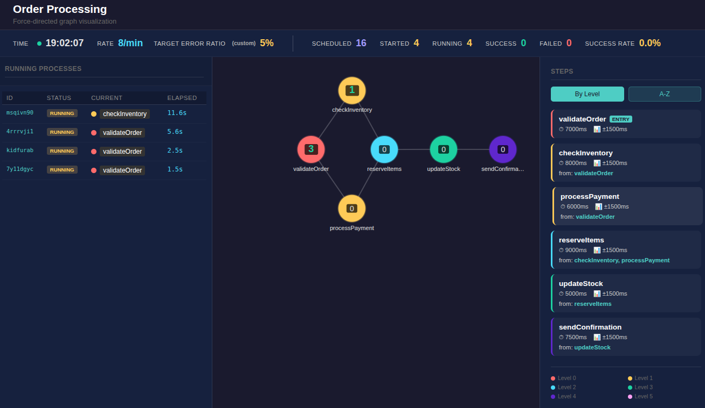

# Flow Logs Generator

Simulate business processes and generate structured JSON logs for testing and development purposes.


## Installation

```bash
npm install
```

## Quick Start

### Using Node.js directly

```bash
node src/index.js config/default.json
```

The web viewer is enabled by default. Access it at: **http://localhost:8123**

### Using Docker

```bash
# Run with default config
docker run -p 8123:8123 alainpham/flow-logs-generator:latest

# Use your own config (replace default.json)
docker run -p 8123:8123 -v $(pwd)/my-config.json:/app/config/default.json alainpham/flow-logs-generator:latest
```

### Using Kubernetes

```bash
# Apply the deployment directly from GitHub
kubectl apply -f https://raw.githubusercontent.com/alainpham/flow-logs-generator/refs/heads/master/k8s/deployment.yaml
```


## Usage

### Basic Commands

```bash
# Run with configuration (web + continuous loop by default)
node src/index.js <config-path>

# Run without web viewer
node src/index.js <config-path> --no-web

# Save output to a file
node src/index.js <config-path> -o <output-file>

# List available configurations
node src/index.js --list
```

### Continuous Mode

The continuous mode simulates a full 24-hour period with traffic scheduling. You define how many process instances should run per minute for different time boxes throughout the day. The simulation loops continuously.

```bash
# Run and save logs to file
node src/index.js config/default.json -o logs.jsonl
```

Press `Ctrl+C` to stop the simulation at any time.

### Examples

```bash
# Run without web viewer
node src/index.js config/default.json --no-web

# Open web viewer on custom port
node src/index.js config/default.json --port 9000
```

### Web Viewer

The web viewer launches automatically. Access it at **http://localhost:8123**

```bash
node src/index.js config/ecommerce-checkout.json
```

The web viewer provides:
- **Interactive force-directed graph** powered by D3.js
- **Drag nodes** to rearrange the layout
- **Zoom and pan** using mouse/trackpad
- **Hover tooltips** showing step details
- **Step list panel** with sorting options
- **Color-coded levels** for easy identification

## Configuration Format

Create a JSON file with your process definition:

```json
{
  "name": "Your Process Name",
  "steps": [
    {
      "name": "stepName",
      "avgDuration": 1000,
      "stdDeviation": 100,
      "errorRatio": 0.05,
      "dependencies": []
    }
  ]
}
```

### Configuration Parameters

**Process-level:**
| Parameter | Type | Description |
|-----------|------|-------------|
| `name` | string | Process name |
| `steps` | array | Array of step definitions |
| `trafficSchedule` | array | Time-based traffic pattern for continuous mode |

**Step-level:**
| Parameter | Type | Description |
|-----------|------|-------------|
| `name` | string | Step name |
| `avgDuration` | number | Average execution time in milliseconds |
| `stdDeviation` | number | Standard deviation for execution time variation |
| `errorRatio` | number | Probability of error (0.0 - 1.0) |
| `dependencies` | array | List of step names that must complete before this step |

### Dependencies

Steps are executed in topological order based on their dependencies. A step will only start after all its dependencies have completed successfully.

Example dependency chain:
```json
{
  "name": "Order Fulfillment",
  "steps": [
    { "name": "validate", "avgDuration": 50, "stdDeviation": 10, "errorRatio": 0.02, "dependencies": [] },
    { "name": "processPayment", "avgDuration": 500, "stdDeviation": 100, "errorRatio": 0.1, "dependencies": ["validate"] },
    { "name": "shipOrder", "avgDuration": 200, "stdDeviation": 50, "errorRatio": 0.05, "dependencies": ["processPayment"] }
  ]
}
```

### Traffic Schedule (Continuous Mode)

For continuous 24-hour simulations, define a traffic schedule with time boxes and instances per minute:

```json
{
  "name": "Order Processing",
  "steps": [
    { "name": "validateOrder", "avgDuration": 50, "stdDeviation": 10, "errorRatio": 0.05, "dependencies": [] },
    { "name": "processPayment", "avgDuration": 500, "stdDeviation": 100, "errorRatio": 0.1, "dependencies": ["validateOrder"] }
  ],
  "trafficSchedule": [
    { "startHour": 0, "endHour": 6, "instancesPerMinute": 2 },
    { "startHour": 6, "endHour": 9, "instancesPerMinute": 10 },
    { "startHour": 9, "endHour": 17, "instancesPerMinute": 30 },
    { "startHour": 17, "endHour": 20, "instancesPerMinute": 20 },
    { "startHour": 20, "endHour": 24, "instancesPerMinute": 8 }
  ]
}
```

| Parameter | Type | Description |
|-----------|------|-------------|
| `startHour` | number | Start of time box (0-23) |
| `endHour` | number | End of time box (0-24) |
| `instancesPerMinute` | number | Number of process instances to start per simulated minute |

## Log Output Format

Each log entry is a JSON object on a single line:

### Process Started
```json
{
  "timestamp": "2026-04-09T22:17:32.214Z",
  "type": "PROCESS_STARTED",
  "processId": "aB3xY7z2",
  "processName": "Order Processing"
}
```

### Step Started
```json
{
  "timestamp": "2026-04-09T22:17:32.214Z",
  "type": "STEP_STARTED",
  "stepName": "validateOrder",
  "processId": "aB3xY7z2",
  "dependencies": []
}
```

### Step Completed
```json
{
  "timestamp": "2026-04-09T22:17:32.258Z",
  "type": "STEP_COMPLETED",
  "stepName": "validateOrder",
  "processId": "aB3xY7z2",
  "durationMs": 43,
  "status": "SUCCESS"
}
```

### Step Failed
```json
{
  "timestamp": "2026-04-09T22:17:36.840Z",
  "type": "STEP_FAILED",
  "stepName": "checkInventory",
  "processId": "aB3xY7z2",
  "durationMs": 225,
  "status": "ERROR",
  "error_message": "Authentication failed",
  "error_code": "AUTHENTICATION",
  "error_recoverable": false,
  "error_context": {
    "userId": "user_5786",
    "method": "basic"
  }
}
```

### Process Completed
```json
{
  "timestamp": "2026-04-09T22:17:33.445Z",
  "type": "PROCESS_COMPLETED",
  "processId": "aB3xY7z2",
  "processName": "Order Processing",
  "totalDurationMs": 1230,
  "status": "SUCCESS"
}
```

### Process Failed
```json
{
  "timestamp": "2026-04-09T22:17:39.210Z",
  "type": "PROCESS_FAILED",
  "processId": "aB3xY7z2",
  "processName": "Order Processing",
  "totalDurationMs": 238,
  "status": "FAILED",
  "failedStep": "checkInventory"
}
```

## Error Codes

When a step fails, one of the following error codes is randomly selected:

| Code | Message | Recoverable |
|------|---------|-------------|
| `TIMEOUT` | The operation exceeded the maximum allowed time | Yes |
| `VALIDATION` | Input validation failed | No |
| `NETWORK` | Network request failed | Yes |
| `DATABASE` | Database operation failed | No |
| `AUTHENTICATION` | Authentication failed | No |
| `AUTHORIZATION` | Authorization denied | No |
| `RESOURCE_NOT_FOUND` | Required resource not found | No |
| `RATE_LIMIT` | Rate limit exceeded | Yes |
| `SERVICE_UNAVAILABLE` | Service temporarily unavailable | Yes |
| `INTERNAL_ERROR` | Internal server error occurred | No |
| `CONFIGURATION` | Configuration error detected | No |
| `DEPENDENCY_FAILED` | Dependency step failed | No |

## Parsing Logs

Since logs are JSON Lines format, you can parse them easily:

```bash
# View pretty-printed logs
cat logs.jsonl | jq .

# Filter for errors only
cat logs.jsonl | jq -c 'select(.type == "STEP_FAILED")'

# Count failures by step
cat logs.jsonl | jq -c 'select(.type == "STEP_FAILED") | .stepName' | sort | uniq -c

# Calculate average step duration
cat logs.jsonl | jq 'select(.type == "STEP_COMPLETED") | .durationMs' | jq -s 'add / length'
```

## Visualizing Process Graphs

Generate a visual DAG (Directed Acyclic Graph) of your process configuration:

```bash
# Draw DAG
node src/visualize.js config/default.json

# Draw compact text mode
node src/visualize.js config/default.json -s

# List steps only
node src/visualize.js config/default.json --list
```

Example output with branching:
```
╔════════════════════════════════════════════════════════════╗
║ Process: E-Commerce Checkout                              ║
╚════════════════════════════════════════════════════════════╝

Levels: L0  →  L1  →  L2  →  L3  →  L4  →  L5
        ──────────────────────────────

┌───────────────┐     ┌───────────────┐     ┌───────────────┐
│validateCart   │     │checkStock     │     │applyDiscounts │
│30ms           │──────100ms          │──────90ms           │
└───────────────┘     └───────────────┘     └───────────────┘
                      ┌───────────────┐
                      │calcShipping   │
                      │80ms           │──────
                      └───────────────┘
                      ┌───────────────┐
                      │calcTax        │
                      │60ms           │──────
                      └───────────────┘

DEPENDENCIES:
  validateCart       [ENTRY]
  checkStock         ← validateCart
  calcShipping       ← validateCart
  calcTax            ← validateCart
  applyDiscounts     ← checkStock, calcShipping, calcTax
```

## Project Structure

```
flow-logs-generator/
├── package.json
├── src/
│   ├── index.js       # CLI entry point
│   ├── visualize.js   # Process graph visualization (terminal)
│   ├── logger.js      # JSON logging and error generation
│   ├── process.js     # Process execution with dependency resolution
│   ├── step.js        # Individual step execution
│   ├── config.js      # Configuration loading
│   └── utils.js       # Utility functions
├── static/
│   └── viewer.html    # Web-based force-directed graph (D3.js)
└── config/
    ├── default.json   # Example: Order fulfillment process
    ├── user-registration.json  # Example: User registration process
    └── ecommerce-checkout.json # Example: Complex branching process
```

## Docker

### Build and Run

```bash
# Build the Docker image
docker build -t alainpham/flow-logs-generator:latest .

# Run the container
docker run -p 8123:8123 alainpham/flow-logs-generator:latest
```

The web viewer is enabled by default. Access it at: **http://localhost:8123**

### Using a Different Config

Replace the default config file by mounting your own:

```bash
# Mount your config file as default.json
docker run -p 8123:8123 -v $(pwd)/config/my-config.json:/app/config/default.json alainpham/flow-logs-generator:latest
```

### Push to Docker Hub

```bash
docker push alainpham/flow-logs-generator:latest
```
